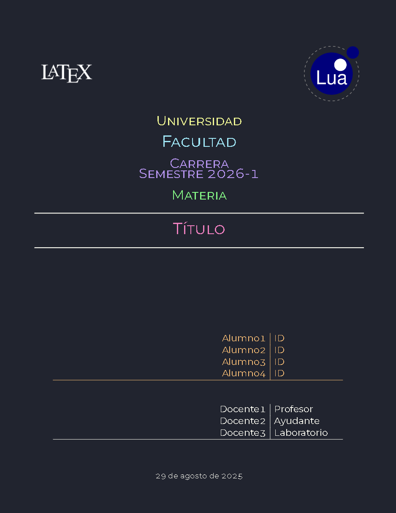
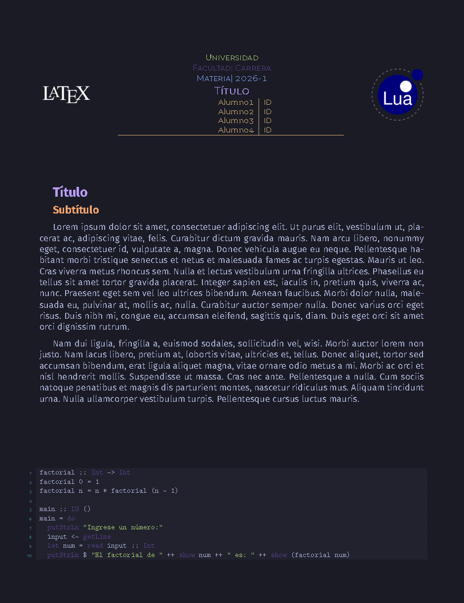

# Portada LaTeX - dark themed

> [!IMPORTANT]
> Se usa **pdfLaTeX**.

## Overleaf (almost) ready

Descargar como ZIP, extraer, e importar a Overleaf los archivos dentro de la carpeta recien extraida.

Es necesario que el compilador sea **pdfLaTeX** (Usado por defecto).

Si quieres comprobarlo, puedes checarlo en `Menú` > `Compiler` > `pdfLaTeX`.

Para cambiar los logos de universidad y facultad reemplazar los archivos `resources/logo/Logo_Universidad` y `resources/logo/Logo_Facultad`. De preferencia se busca que se tenga una relación de aspecto entre 1:1 a 1:1.125.

En `sample.bib` se encuentra un archivo listo para el uso de BibTeX.

En el archivo `style.tex` se pueden cambiar los datos de la portada, colores y tipografía.
Las imágenes default son de dominio público por Wikimedia Commons.

El archivo `sections/elementos.tex` contiene ejemplos de uso. Para eliminarlo, ir a `main.tex` y eliminar las líneas (39 aprox.):

```latex
    % ------------
    % Archivo temporal con ejemplos
    \input{sections/elementos}
    % ------------
```

## Resultados

- [Resultado tema 1 - Portada completa](./output/out.pdf)

<table>
    <thead>
        <th>Tema 1: Portada completa</th>
        <th>Tema 4: Portada de cuarto</th>
    </thead>
    <tbody>
        <tr>
            <td></td>
            <td></td>
        </tr>
    </tbody>
</table>

## Estructura

- `docUI/` : Carpeta con datos de UI como temas y colores; y datos del preámbulo como paquetes, comandos.
- `resources/` : Carpeta dedicada a imágenes.
- `sections/` : Carpeta destinada a contener `*.tex` con secciones o contenido. De preferenicia agregar `\input{<nombre del archivo a agregar>}` en `sections/section.tex`.

## Estilo

### Temas

Cuenta con cuatro temas de colores en `/docUI/Extras.tex`:

(Nombre (código a escribir en `\tema`))

- Darkcula (darkcula) :: Dracula MIT Licence |  [draculatheme.com/contribute](https://draculatheme.com/contribute)
- TwoDark (twodark) :: OneDark MIT Licence | [github.com/one-dark/github-one-dark-theme](https://github.com/one-dark/github-one-dark-theme)
- AyuhDark (ayuh) :: AyuDark MIT Licence | [github.com/ayu-theme/ayu-colors?tab=readme-ov-file](https://github.com/ayu-theme/ayu-colors?tab=readme-ov-file)
- Osaka Night (osakanight) :: TokyoNight MIT Licence | [github.com/tokyo-night/tokyo-night-vscode-theme](https://github.com/tokyo-night/tokyo-night-vscode-theme)

Para seleccionar un tema, escribir en `style.tex` en `\newcommand{\tema}{<código de tema>}` el tema a elegir, ejemplo: `\newcommand{\tema}{darkcula}`.

### Tipografía

Se cuenta con 3 tipografías además de la default.

- FiraMono (firamono)
- FiraSans (firasans)
- Roboto (roboto)

Modificable en `style.tex` en `\newcommand{\fuente}{<código de fuente>}` ejemplo: `\newcommand{\tema}{firasans}`. Si se deja otra clave, se tomará la fuente default. En este caso, se puede modificar la familia default cuando no se use `\newcommand{\famdef}{<familia>}`, ejemplo: `\newcommand{\famdef}{\sffamily}`.

Para más información visitar [Font Catalogue](https://tug.org/FontCatalogue/allfonts.html)

### Elementos

Por defecto se tiene la portada completa, pero se puede cambiar a portada de cuarto de página en `style.tex` en `\newcommand{\portada}{<número>}`, siendo `0` para completa y `1` para la de cuarto de página.

Todo listo para ser modificado.

## Documentación

Se encuentra con una documentación ligera para su uso.

> [!TIP]
> Para dudas [contáctame](https://github.com/CCWebi).
